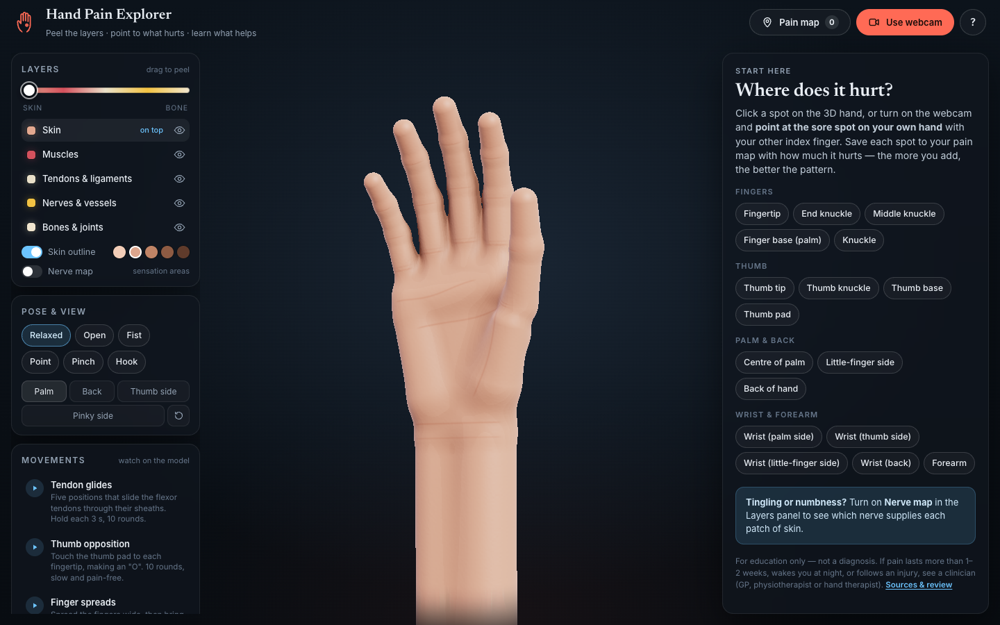
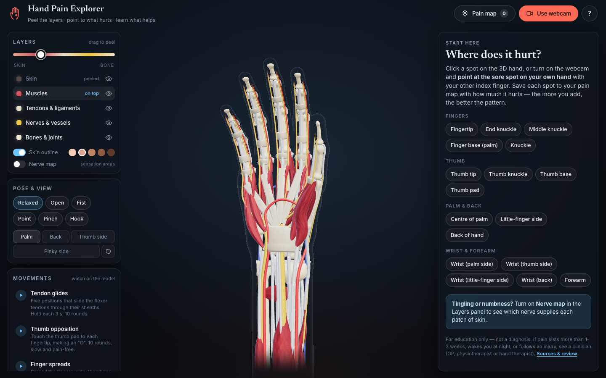
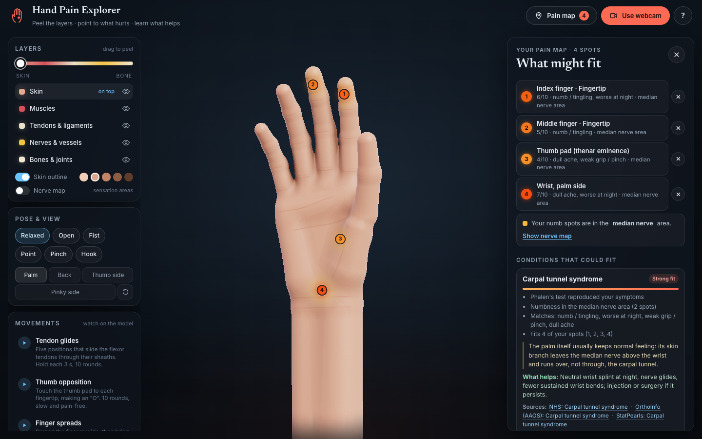
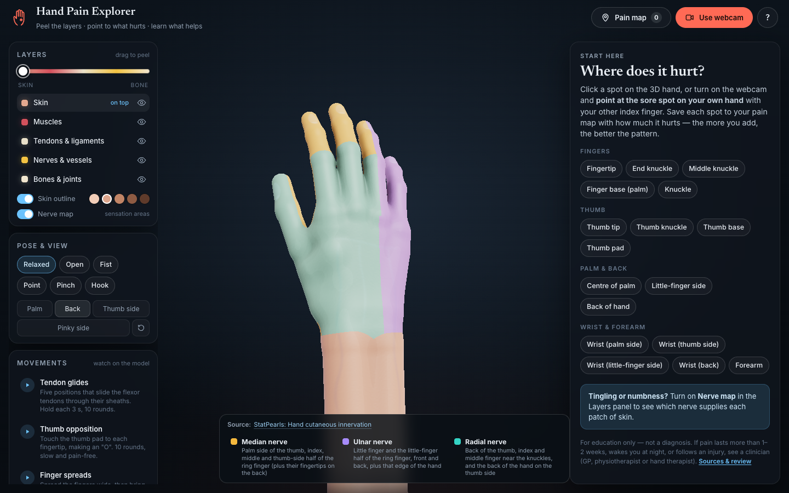

# Hand Pain Explorer

An interactive 3D hand for exploring hand pain. Peel back skin, muscles, tendons and nerves down to the bones, point at a sore spot on your own hand through your webcam (or click it), and see possible causes, self-checks, recovery tips and warning signs.



**Live:** <https://tarunt27.github.io/hand-pain-explorer/> (deploys from `main` via GitHub Pages; needs Pages enabled once in the repo settings).

> **Educational only — not a diagnosis.** If pain is severe, follows an injury, lasts more than a couple of weeks, or comes with numbness, weakness, fever or colour change, see a clinician.

## Features

**Layered anatomy you can peel**
- Five layers — skin, muscles, tendons & ligaments, nerves & vessels, bones & joints — built procedurally in Three.js.
- Bones are sculpted from anatomical shape definitions: two-knobbed knuckle heads, cupped joint bases, spade-shaped fingertip bones, a waisted scaphoid, a crescent lunate, the hook of the hamate, and the radius with its styloid and Lister's tubercle.
- The skin has the palm's main creases, finger and wrist creases, knuckle wrinkles, veins on the back of the hand, fingertip pads and nails with a lunula.
- Soft tissues include the extensor hood (sagittal and lateral bands), finger pulleys, volar plates, the carpal tunnel ligament and the dorsal veins.
- Drag the Layers slider (or press `[` / `]`) and each layer dissolves away like a glove sliding off.
- Everything is attached to the skeleton: tendons slide over the joints, muscles bulge, and the skin bends and webs as the fingers move.
- Hover any structure to see what it is and what it does.



**Webcam hand tracking** (MediaPipe Hand Landmarker, runs entirely in the browser)
- **One hand:** the 3D hand copies your finger positions and wrist rotation.
- **Point at your other hand:** touch the sore spot with your index finger and hold still for about a second. The matching spot lights up on the model, opens in the side panel, and is saved to your pain map. It works on the palm or the back of the hand.
- **Pinch with both hands and pull apart:** peels the layers.
- Tuned for real cameras: One Euro smoothing, stable hand identities, gesture hysteresis, a short hold when one hand hides the other, and automatic left/right calibration. A **Tracking details** readout helps with further tuning.

**Pain map and "What might fit"**
- Save up to 8 sore spots, each with a 0–10 pain level, how long it has hurt, which hand, and symptoms — including the ones that separate emergencies from sprains: red/hot or fever, a cut or bite, a joint that won't move.
- A **red-flag checklist** comes before any ranking, and urgent conditions whose key symptom you ticked appear in a **Don't miss** list regardless of rank.
- The **nerve map** colours (and patterns) the skin by which nerve supplies it, and numb spots are matched to the nerve they share — including the elbow-vs-wrist clue for the ulnar nerve and the palm-sparing clue for carpal tunnel.
- Nine self-checks are demonstrated on the model with their published reliability; answers refine the ranking, and tests that load an injured area are withheld when you've described an injury.
- Results are labelled by **how much evidence** supports them ("Common here" for location alone, up to "Most consistent"), never by rank alone.
- Each spot keeps a **history**, so repeat check-ins show a trend. **Print / save PDF**, copy, export and import your map.

<p>
  
  
</p>

**Content**
- 17 hand, wrist and forearm areas, each with the structures underneath, common causes, tips, gentle movements and red flags.
- Animated exercises: tendon glides, thumb opposition, finger spreads, wrist bend and lift, median nerve glide and thumb circles.

## Sources and review

Every condition and self-check links to the pages it was checked against: NHS, AAOS OrthoInfo, StatPearls (NCBI Bookshelf) and a few PubMed Central reviews, 74 sources in all. [about.html](about.html) explains the ranking weights, sources and privacy in plain language; [`docs/content-review-pack.md`](docs/content-review-pack.md) is the generated, code-free version of all content for reviewers. [CONTENT_REVIEW.md](CONTENT_REVIEW.md) lists what was checked, what was corrected, the known limitations and a checklist for clinician review.

**The content hasn't yet been reviewed by a licensed clinician.** If you are one and can help, see [REVIEWERS.md](REVIEWERS.md).

## Run it locally

It's a static site with no build step. The webcam needs `localhost` or HTTPS, so serve the folder rather than opening `index.html` directly:

```bash
python3 serve.py
```

Then open <http://localhost:8743> in Chrome, Edge or Safari. Run the tests with `node --test test/*.test.mjs`; CI runs them, a content lint and a weekly link check. `serve.py` is a small static server that sends no-cache headers so edits show up on reload. Any static server works, for example `npx serve .`.

Three.js and MediaPipe load from CDNs, so you need an internet connection.

### Deep links

Query parameters open a specific view, for example `?peel=2&nerves=1&view=back&region=thumbBase`.

| Parameter | Values |
| --- | --- |
| `peel` | `0` (skin) to `4` (bones) |
| `nerves` | `1` shows the nerve map |
| `view` | `palm`, `back`, `thumb`, `pinky` |
| `region` | e.g. `wristPalmar`, `thumbBase`, `pip` (with `finger=index\|middle\|ring\|pinky`) |
| `hand` | `left` or `right` |
| `pose` | `relaxed`, `open`, `fist`, `point`, `pinch`, `hook` |

### Hosting

Because it's static, it runs on GitHub Pages, Netlify, Vercel or any HTTPS host. HTTPS is required for webcam access.

## How it works

| File | What it does |
| --- | --- |
| `js/rig.js` | Joint hierarchy (right-hand base model, mirrored for left hands), bone placement, pose maths |
| `js/bonemesh.js` | Anatomical bone shapes as signed-distance functions, meshed at load time with surface nets |
| `js/soft.js` | Muscles, tendons, pulleys, ligaments, nerves and arteries as tubes anchored to the bones and rebuilt as the hand moves |
| `js/skin.js` | Skin as a ray-marched signed-distance field (smooth-blended round cones) with creases, wrinkles, veins, nails, ambient occlusion, nerve territories and the pain heat map |
| `js/materials.js` | Shared shader patch: peel/dissolve, pain hotspot, hover and structure highlight |
| `js/tracking.js` | MediaPipe setup, One Euro smoothing, hand identity, gestures, retargeting landmarks onto joint angles, fingertip-to-hand mapping |
| `js/poses.js` | Pose presets, exercise and self-check timelines, thumb inverse kinematics |
| `js/content.js` | Regions, causes, tips, red flags, nerve areas, conditions, self-checks and their sources |
| `js/analysis.js` | Scores conditions from the pain map, symptoms, onset, hand, nerve pattern and self-check answers; evidence-based labels; the "Don't miss" list; the printable summary text |
| `js/hand-data.js` | Finger measurements shared by the rig and the analysis, with no 3D dependency |
| `test/` | Node tests for the ranking and a lint of the content's cross-references |
| `scripts/` | Review-pack generator and source link checker |
| `js/main.js` | Scene, picking, panels, pain map, webcam gestures and the render loop |

Units are centimetres. The base model is a right hand with +X radial, +Y distal and +Z palmar. Webcam landmarks are converted to a first-person frame, so the 3D hand moves the way you see your own hand.

## Privacy

Video is processed on your device by MediaPipe and never uploaded. Your pain map and self-check answers are saved only in your browser's local storage.

## Disclaimer

This project is for education. It ranks common conditions by how well they match what you enter; it cannot examine you, and it is not medical advice, a diagnosis or a treatment plan.

## Credits

- [Three.js](https://threejs.org) for 3D rendering
- [MediaPipe Hand Landmarker](https://ai.google.dev/edge/mediapipe/solutions/vision/hand_landmarker) for hand tracking
- Fonts: [Inter](https://rsms.me/inter/) and [Newsreader](https://fonts.google.com/specimen/Newsreader)

## License

[MIT](LICENSE)
